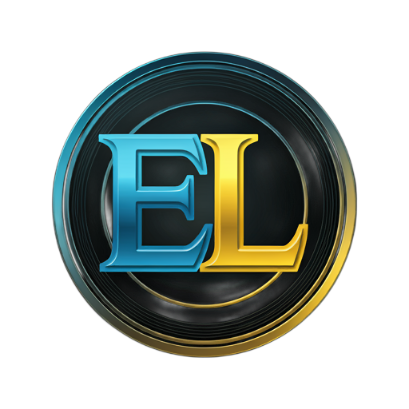

# 🎮 Emulator Launcher

Emulator Launcher is a one-stop solution for playing classic games across a variety of consoles! With this launcher, enjoy the nostalgia of playing games from consoles like Game Boy, Game Boy Color, Game Boy Advance, DOS, Nintendo DS, Nintendo 3DS, GameCube, Wii, and PlayStation 2, all in one place.

## 🚀 Features
- **Multi-Console Support**: Launch and play ROMs from:
  - Game Boy, Game Boy Color, and Game Boy Advance
  - DOS
  - Nintendo DS and Nintendo 3DS
  - GameCube and Wii
  - PlayStation 2
- **User-Friendly Interface**: Easy to navigate and find your favorite games.
- **Lightweight**: No unnecessary bloat—only what you need to get started quickly.

## 🛠 Installation
1. **Download**: Head to the [Releases](https://github.com/bobbydanieljones/Emulator-Launcher-Public/releases) section of this repository.
2. **Unzip**: Extract the downloaded file to any directory of your choice.
3. **Run**: Double-click `Emulator Launcher.exe` to start the launcher.

## 📂 Usage
Simply load up your favorite ROMs for the supported consoles, and you’re ready to play. Emulator Launcher does the rest to ensure a seamless gaming experience!

## 🔧 Requirements
- Windows (7, 8, 10, or 11)
- Recommended: At least 4GB RAM for smoother gameplay, especially for more demanding consoles like GameCube, Wii, and PlayStation 2.
- .NET Framework

## 📞 Support
If you encounter any issues or have questions, feel free to open an issue or reach out via the discussions section.

Enjoy playing your favorite games, and happy retro-gaming! 🎉
